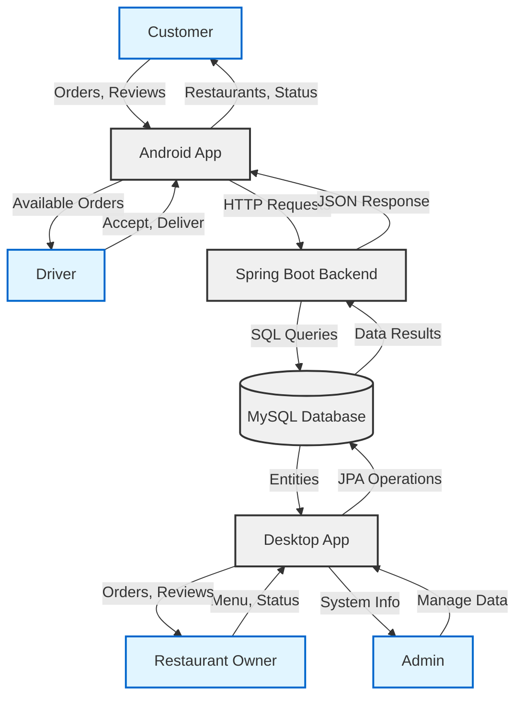

```mermaid
graph TB
    C[Customer]
    D[Driver]
    R[Restaurant Owner]
    A[Admin]
    Android[Android App]
    Desktop[Desktop App]
    Backend[Spring Boot Backend]
    DB[(MySQL Database)]

    C -->|Orders, Reviews| Android
    Android -->|Restaurants, Status| C

    D -->|Accept, Deliver| Android
    Android -->|Available Orders| D

    R -->|Menu, Status| Desktop
    Desktop -->|Orders, Reviews| R

    A -->|Manage Data| Desktop
    Desktop -->|System Info| A

    Android -->|HTTP Requests| Backend
    Backend -->|JSON Response| Android

    Backend -->|SQL Queries| DB
    DB -->|Data Results| Backend

    Desktop -->|JPA Operations| DB
    DB -->|Entities| Desktop

    classDef userStyle fill:#e1f5ff,stroke:#0066cc,stroke-width:2px
    classDef systemStyle fill:#f0f0f0,stroke:#333,stroke-width:2px

    class C,D,R,A userStyle
    class Android,Desktop,Backend,DB systemStyle
```
